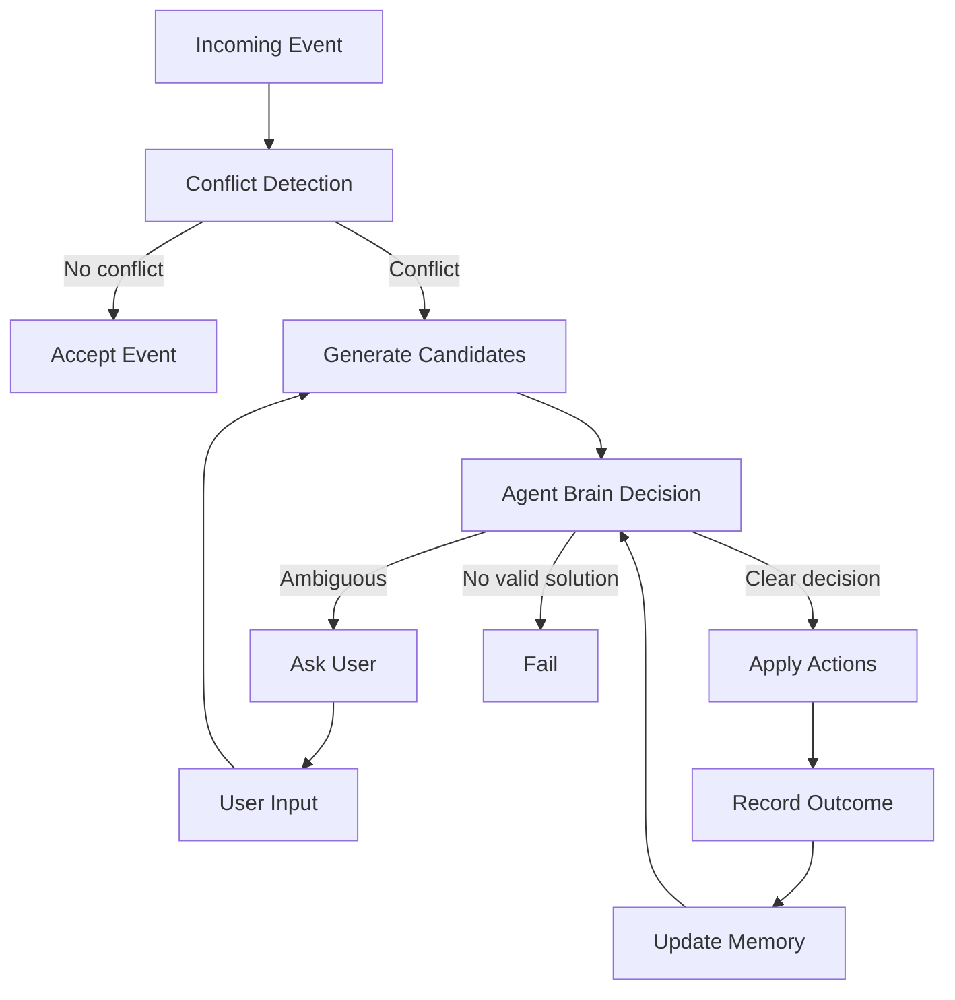

# Family Conflict Agent (Showcase)

Tiny, generic example of an **agentic family-scheduling workflow**.

This project shows when a normal script is not enough: the system must
plan, ask a follow-up question when decisions are ambiguous, and replan.

Companion write-up: `article.md`.

## What It Demonstrates

- Detects blocking conflicts (time overlap + travel/buffer constraints).
- Generates multiple repair plans (move incoming event vs. move existing).
- Uses an explicit system prompt in `SYSTEM_PROMPT.md`.
- Routes ambiguous tie-breaks through `brain.py`.
- Requests human input when plans are equally good.
- Stores simple outcome feedback and reuses it for future tie-breaks.
- Re-runs with the answer and outputs executable calendar actions.

## Flow (Mermaid)



## Run

```bash
python demo.py
```

Optional (LLM-backed brain):

```bash
FAMILY_AGENT_ENABLE_LLM_BRAIN=1 FAMILY_AGENT_BRAIN_PROVIDER=ollama python demo.py
```

You will see:

1. First pass: `needs_input` with a concrete question.
2. Second pass: `resolved` after providing a preference.
3. Third pass: same conflict auto-resolves from stored feedback.

## Why It Matters

- Driving-dependent events now require available eligible drivers.
- Shared resources (for example `family-car`) now block events while
  unavailable (for example multi-day garage windows).

## Example (Before vs After)

```text
Before:
status: resolved
issue: child driving event could pass while no driver/car was available

After:
status: needs_input
question: No movable option found. Allow moving fixed events up to 120 minutes?
```

```text
Available driver + car:
status: resolved
action: add_event
```

## Files

- `agent.py` — conflict-resolution agent loop.
- `brain.py` — system-prompt-driven decision brain.
- `demo.py` — minimal reproducible scenario.
- `SYSTEM_PROMPT.md` — brain policy contract.
