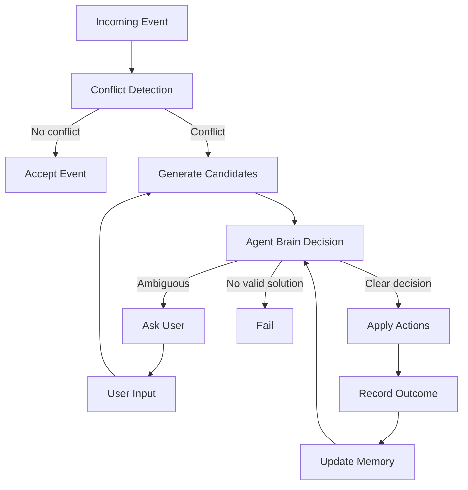

Recently, I have been thinking about agents—not from the angle of "how to build one," but why they matter at all. Most of the conversation today is still centered around prompts: how to phrase them, how to structure them, how to squeeze better answers out of a model. This framing is convenient, and it is also wrong.

A prompt is a request. An agent is a way of thinking.

If you optimize prompts, you get better sentences. If you build agents, you get better decisions. That distinction is not semantic—it is operational, and it shows up immediately in how systems behave. It determines whether you are shaping outputs or shaping behavior. And only one of those scales.

The Real Motivation: Forcing a Mindset
The reason to build an agent is not automation. It is control over how the model approaches a problem before it produces an answer.

Different domains require different cognitive starting points. A teacher who begins by explaining is often ineffective; good teaching starts with diagnosis. A financial auditor does not begin by agreeing with the numbers; they begin by assuming something is off and looking for inconsistencies. A strong operator does not rush into action; they first structure the situation.

These are not stylistic preferences. They are distinct reasoning patterns.

General-purpose tools like Claude Code or Cursor are excellent at what they were shaped to do. They decompose problems, move forward, and generate output efficiently. That mindset is extremely useful in programming contexts, but it becomes limiting when applied elsewhere.

When you ask such a system to teach, it explains too early. When you ask it to audit, it is not sufficiently skeptical. When you ask it to handle collections, it jumps directly to writing the email before deciding whether an email should be sent at all. The result is often fluent and plausible, but fundamentally misaligned with the task. In practice, this is how you get very well-written wrong decisions.

Agents exist to correct that—not by improving phrasing, but by enforcing the correct starting point.

Claude Code → Claude You
Most people try to build an agent directly, as if the intelligence is already inside the model and only needs to be "unlocked." In practice, this assumption is wrong.

The model provides capability. The builder provides direction—and usually the mistakes.

A more reliable approach is to begin by using Claude as if it already behaves correctly, and then force it into that behavior step by step. When it is too shallow, you push it. When it skips steps, you block it. When it produces output prematurely, you redirect it back into decision-making.

What you are doing in that process is not discovering the model's abilities. You are projecting your own standard of thinking into it.

An agent is simply a frozen version of that interaction. It reflects the level of discipline you enforced during its creation. If your thinking is shallow, the agent will be shallow. If your thinking is structured, the agent will carry that structure forward.

The limiting factor is not the model. It is the builder's judgment.

A Concrete Example: The Problem Is Not Writing the Email
Consider a simple operational task: collecting unpaid invoices.

At first glance, this appears to be a communication problem—write a better reminder email, improve tone, optimize wording. In practice, that framing is misleading. The hard part is not writing the email. The hard part is deciding whether an email should be sent at all, and what objective it should serve. Most systems are optimized for the first problem.

I did not start by building an agent. I started by solving a single case correctly.

Step 1: Do it once
We have this client:

18 days overdue

previously promised to pay

no payment received

What should we do? Do not write an email yet. Think step by step.

The initial response suggested sending a reminder. That answer was not incorrect, but it was incomplete. It ignored the behavioral context: the client had already committed to paying and failed to follow through.

So I pushed the model to re-evaluate:

This is incomplete.

The client already promised to pay

No payment was received

You need to decide: Is this a reminder or escalation?

This constraint forced a shift. The model could no longer default to generating text; it had to classify the situation first. That change alone improved the quality of reasoning more than any phrasing tweak would have.

We iterated for several turns, tightening what mattered, correcting assumptions, and forcing the model to consider behavior rather than just elapsed time. Eventually, the reasoning aligned with how I would approach the case.

Only then did I allow it to generate the email.

Step 2: Freeze it
Once the interaction behaved correctly, I did not attempt to rewrite it from scratch. Instead, I asked Claude Code to formalize it:

Turn this into an agent.

The agent must:

Decide whether to act

Decide the goal (reminder / confirmation / escalation)

Only then generate the email

It must not skip directly to writing.

At this point, the system was no longer a conversation. It was a structured decision process. The key was not the wording—it was the enforced sequence.

Step 3: Run it—and let it fail
With the agent in place, I began using it in practice. It performed well on familiar cases, but quickly exposed weaknesses when confronted with ambiguity. This is the part most people try to avoid.

For example, when a client responded with "I'll pay next week," the agent interpreted this as a valid commitment and reduced pressure. That behavior is common in human interactions, but in collections it is often a mistake. Vague promises are not reliable signals of payment.

The failure was not stylistic. It was conceptual. Which is a polite way of saying the agent sounded right and was wrong.

Step 4: Fix the thinking
Rather than adjusting phrasing, I showed the agent the specific error:

The agent classified this as a valid commitment.

This is wrong.

"next week" is not specific and often leads to no payment.

Fix the agent:

distinguish between vague promises and real commitments

only treat specific dates as valid commitments

The agent updated its logic accordingly.

A second failure appeared shortly after: it assumed that a positive response implied payment had occurred. Again, the issue was not language—it was an incorrect inference about state.

The agent assumes payment based on conversation.

This is wrong.

It must verify payment_status before closing a case.

Fix it.

Each correction targeted a specific assumption. None of them were visible from the prompt alone. Over time, these adjustments accumulated into a system that behaved differently—not just one that sounded better.

Step 5: Inject better thinking
At a certain point, improvements stop coming from the interaction itself. You encounter better approaches externally—frameworks, strategies, domain-specific heuristics.

Instead of rebuilding the agent, you can inject that knowledge directly:

Here is a better approach to collections:

[paste article / framework]

Update the agent to incorporate this logic.

The goal is not for the model to summarize the material, but to internalize it into its decision process. This marks a shift from correcting errors to upgrading the underlying reasoning.

Step 6: Shamelessly clone — then give it a brain
Iteration alone will take you far, but eventually you encounter limitations that are structural rather than conceptual. Questions of memory, planning, verification, and decomposition begin to matter.

At that stage, it is unnecessary to invent solutions from first principles. Existing systems already implement these patterns effectively. Repositories such as:

https://github.com/x1xhlol/system-prompts-and-models-of-ai-tools

provide insight into how production-grade agents are structured.

The value lies not in copying these systems wholesale, but in extracting the principles behind them: when to plan before acting, when to verify instead of trusting, how to structure intermediate reasoning steps. Copying them wholesale usually just imports someone else's mistakes.

By selectively incorporating these ideas, you move from refining outputs to improving the architecture itself.

What the Loop Actually Does
Although this example focuses on collections, the underlying pattern is general.

Retrieval systems tend to collapse to surface similarity unless forced to explore alternative representations. Teaching systems tend to explain prematurely unless constrained to diagnose first. Operational systems tend to over-trust language unless required to verify state.

In each case, the model converges too quickly on a plausible answer.

The builder's role is to slow that convergence, expose weak assumptions, and enforce better decision boundaries. Each individual fix is small, but collectively they reshape the system's behavior.

How to Evaluate an Agent
Evaluating an agent based on its final answer is often misleading. A correct answer can result from flawed reasoning. This is indistinguishable from competence until it fails.

A more reliable approach is to evaluate the process. When an agent fails, the nature of the failure reveals where the reasoning broke down—whether due to missing information, incorrect assumptions, or poor sequencing.

Failures are therefore more informative than successes. They provide direct insight into how the system thinks, rather than how it presents its conclusions.

Where the Intelligence Comes From
It is tempting to attribute the quality of an agent to the underlying model. In practice, the model defines the ceiling of capability, but the builder determines how much of that capability is realized.

Two individuals using the same model can produce vastly different systems, because they impose different standards of reasoning.

If shallow reasoning is accepted, shallow reasoning will persist. If structure and discipline are enforced, the agent will reflect those qualities.

Building agents is ultimately not about writing better instructions. It is about encoding judgment.

Closing Thought
When an agent feels generic, it is rarely due to limitations in the model. More often, it reflects a process that was stopped too early—before the necessary iteration and refinement took place.

The difference is not in the prompt. It is in the willingness to remain in the loop—observing failures, correcting assumptions, and improving structure—until the system behaves as intended.

Prompts generate answers. Agents shape how answers are produced.

Only one of those compounds. The other just sounds good.

---
## Flow (Mermaid)

---

